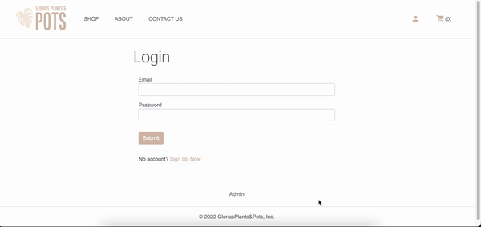

# README

# GloriasPlants&Pots

Glorias Plants & Pots is an e-commerce app built with Rails 7.0 that allows logged-in users to purchase handmade pottery and see previous orders. Users with admin access can maintain storefront by adding new products, updating existing products and deleting unwanted products.

Deployed [here](https://gloriasplantsandpots.herokuapp.com/)

## Final Product

### Demo Video

### Create New User

### Contact Form

### Admin

## Setup

- Install dependencies with `bundle install`.
- Run `bin/rails db:reset` to create, load and seed db
- Create .env file based on .env.example
- Sign up for a Stripe account
- Put Stripe (test) keys into appropriate .env vars
- Run `bin/rails s` to start the server

## Dependencies

- Rails 7.0
- Bootstrap 5.1
- SASS
- PostgreSQL
- Stripe
- Mail Form

## Connect With Me

[Github](https://github.com/gloria-cheung)
-- [Linkedin](http://www.linkedin.com/in/gloria-cheung) --
[Portfolio](http://www.gloria-cheung.com)
